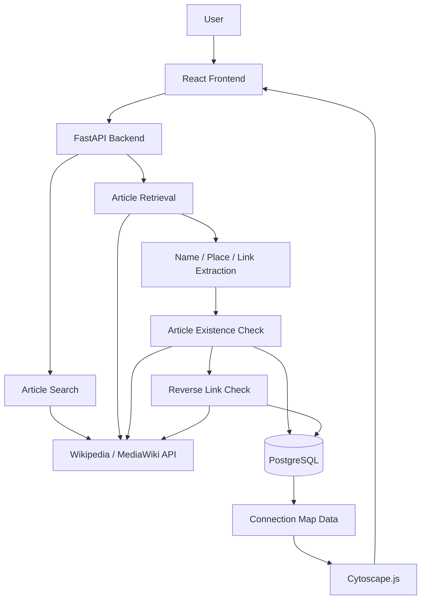
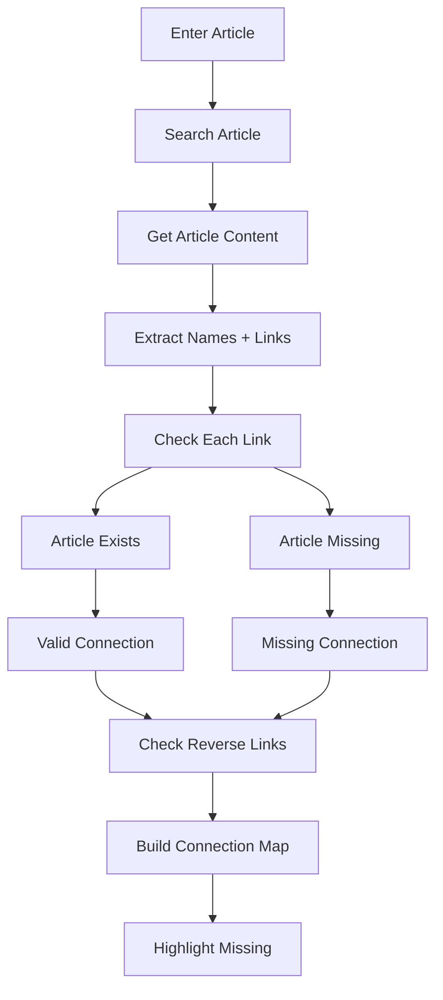
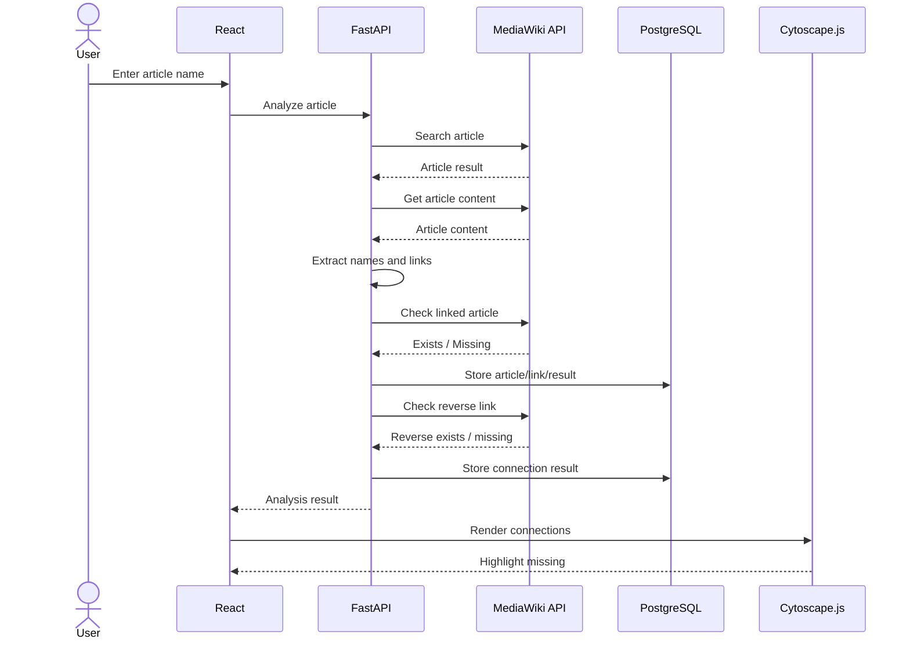
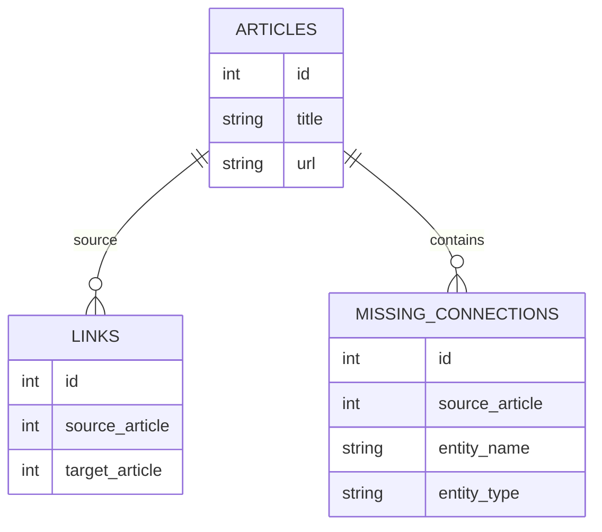

# Find the Missing Connections — Architecture

**File:** `ARCHITECTURE.md`
**Version:** 1.0
**Status:** Draft
**Owner:** `[Project Owner / Technical Lead Name]`
**Review Cycle:** Every major release and every major architectural change
**Last Updated:** Day 1

---

# 1. Overview / Context

**Find the Missing Connections** is a web application that analyzes an article, extracts people, places, and links, checks whether referenced entities have their own articles, detects missing connections and one-way links, and visualizes the resulting connections.

The system uses **React**, **Python/FastAPI**, **Wikipedia/MediaWiki API**, **PostgreSQL**, and **Cytoscape.js** as the core technology stack.

---

# 2. Goals & Constraints

## 2.1 Goals

The architecture must support:

1. Article input/search.
2. Article retrieval.
3. Name and place extraction.
4. Link extraction.
5. Article-existence checking.
6. Missing-connection detection.
7. Reverse-link checking.
8. One-way connection detection.
9. Connection-map generation.
10. Missing-connection highlighting.

These are the defined core project capabilities.

## 2.2 Constraints

| Constraint            | Requirement                                  |
| --------------------- | -------------------------------------------- |
| Cost                  | Use the specified free/open technology stack |
| Article source        | Wikipedia / MediaWiki API                    |
| Frontend              | React                                        |
| Backend               | Python + FastAPI                             |
| Database              | PostgreSQL                                   |
| Graph                 | Cytoscape.js                                 |
| Article retrieval     | API-based                                    |
| Wikipedia scraping    | Not permitted                                |
| Full Wikipedia mirror | Out of scope                                 |
| AI/RAG                | Out of scope for core architecture           |
| Microservices         | Out of scope                                 |
| Kubernetes            | Out of scope                                 |
| Paid vector database  | Out of scope                                 |

The source explicitly says to use MediaWiki API rather than scraping Wikipedia HTML.

---

# 3. Architecture Style

## Decision

**Layered monolith / modular web application**

The initial system will use:

```text
React Frontend
      │
      │ HTTP/REST
      ▼
FastAPI Backend
      │
      ├──────────────► MediaWiki API
      │
      ├──────────────► Analysis Logic
      │
      └──────────────► PostgreSQL
                           │
                           ▼
                    Stored Connections
```

## Why

The project has one core workflow and does not require independently deployed services.

The source explicitly says not to initially build:

* Microservices
* Kubernetes
* Full Wikipedia mirror
* Multi-agent AI
* Paid vector database
* GPU server

Therefore a modular monolith keeps the architecture aligned with the defined project scope.

---

# 4. High-Level Architecture Diagram



## Primary Request Flow



This follows the defined project system flow.

---

# 5. Components

Each component has one primary responsibility.

| Component            | Responsibility                                       | Owner                      |
| -------------------- | ---------------------------------------------------- | -------------------------- |
| React Frontend       | Collect input and display analysis results           | `[Frontend Owner]`         |
| FastAPI API          | Expose application endpoints and coordinate workflow | `[Backend Owner]`          |
| Article Search       | Find requested article through MediaWiki API         | `[Backend Owner]`          |
| Article Retrieval    | Retrieve article content and metadata                | `[Backend Owner]`          |
| Extraction Module    | Extract names, places and links                      | `[Backend Owner]`          |
| Existence Checker    | Determine whether referenced article exists          | `[Backend Owner]`          |
| Reverse Link Checker | Determine whether B links back to A                  | `[Backend Owner]`          |
| Connection Store     | Persist articles, links and missing connections      | `[Database Owner]`         |
| Graph Adapter        | Convert stored connections into graph data           | `[Frontend/Backend Owner]` |
| Cytoscape.js Graph   | Render connection map                                | `[Frontend Owner]`         |

### Responsibility Boundary

```text
Frontend
  ↓
Presentation only

FastAPI
  ↓
Request coordination

Analysis Modules
  ↓
Connection analysis

PostgreSQL
  ↓
Persistent project data

MediaWiki API
  ↓
External article source

Cytoscape.js
  ↓
Connection visualization
```

---

# 6. Data Flow

## 6.1 Article Analysis



## 6.2 Connection States

Every connection can result in:

```text
EXISTS
MISSING
ONE-WAY
```

The source explicitly defines these result states.

---

# 7. Tech Stack

| Layer          | Technology                | Version         | Why Chosen                                       |
| -------------- | ------------------------- | --------------- | ------------------------------------------------ |
| Frontend       | React                     | TBD             | Defined frontend technology                      |
| Backend        | Python                    | TBD             | Defined backend language                         |
| API Framework  | FastAPI                   | TBD             | Defined backend framework                        |
| Article Source | Wikipedia / MediaWiki API | API version TBD | Direct article/link access without HTML scraping |
| Database       | PostgreSQL                | TBD             | Defined persistent storage                       |
| Graph          | Cytoscape.js              | TBD             | Defined connection-map technology                |

The source does not specify exact package/runtime versions, so versions must be pinned during implementation rather than invented in this architecture document.

---

# 8. Data Storage

## 8.1 PostgreSQL

PostgreSQL stores only the data required for the core project.

### Articles

```text
articles
---------
id
title
url
```

### Links

```text
links
-----
id
source_article
target_article
```

### Missing Connections

```text
missing_connections
-------------------
id
source_article
entity_name
entity_type
```

These are the three storage structures explicitly defined by the source.

---

## 8.2 Storage Relationship



## 8.3 Caching

The source specifies response caching as a performance strategy:

```text
User Request
     ↓
Cache
     ↓
Exists?
 ┌───┴───┐
YES     NO
 ↓       ↓
Return  MediaWiki API
         ↓
       Store
         ↓
       Return
```

### Cache Strategy

* Cache article/API responses where appropriate.
* Reuse cached data instead of repeatedly requesting the external API.
* Cache duration: **TBD during implementation**.
* Cache storage technology: **TBD** because the source does not prescribe one.

---

# 9. Integrations

## 9.1 Wikipedia / MediaWiki API

**Purpose:** Retrieve article data, links, and page-existence information.

**Protocol:** HTTP API

**Owner:** `[Backend Owner]`

### Flow

```text
FastAPI
   │
   ▼
MediaWiki API
   │
   ├── Article
   ├── Links
   └── Page existence
```

The architecture intentionally uses the MediaWiki API instead of scraping Wikipedia HTML.

### Timeout

`TBD`

The source requires API timeout handling but does not provide a numeric timeout value.

### Retry Policy

`TBD`

The source does not define a numeric retry count or backoff strategy.

### Failure Behaviour

If the external API cannot provide required article data:

```text
Request
   ↓
MediaWiki API
   ↓
Failure
   ↓
Backend returns controlled error
   ↓
Frontend displays failure state
```

---

# 10. Cross-Cutting Concerns

## 10.1 Authentication

Authentication is **not part of the defined core workflow**.

If authentication becomes a required project requirement, this architecture must be updated before implementation.

## 10.2 Input Validation

The backend must validate article input before processing it.

The source explicitly identifies input validation as a security requirement.

## 10.3 Logging

Application errors and important processing failures should be logged.

**Logging technology:** TBD.

## 10.4 Monitoring

Production monitoring is required for the deployed system.

**Monitoring platform:** TBD.

## 10.5 Error Handling

Errors must be handled at the API boundary instead of exposing raw internal exceptions to the frontend.

Primary failure categories:

* Invalid article input
* Article not found
* MediaWiki API failure
* Database failure
* Graph-data generation failure

## 10.6 Secrets

External API configuration and database credentials must not be hard-coded into source code.

Secrets must be provided through environment configuration.

---

# 11. Deployment / Infrastructure

> **TODO — incomplete section.** The source text for section 11 onward was truncated before being received. Add the remaining sections (deployment/infrastructure, and anything that followed) here.

---

# 12. Open Questions

* Cache technology and TTL.
* External API timeout value.
* External API retry count and backoff strategy.
* Logging platform.
* Monitoring platform.
* Deployment target and hosting model.
