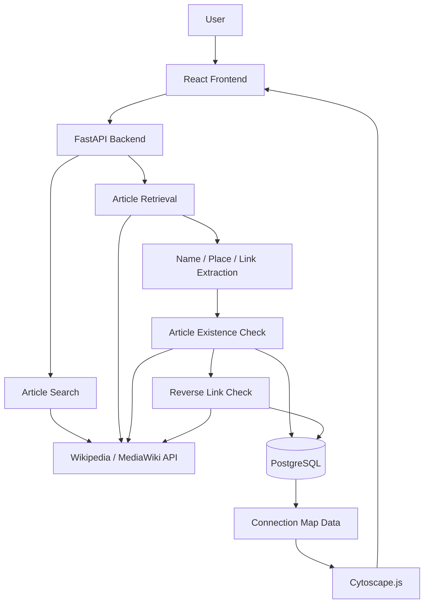
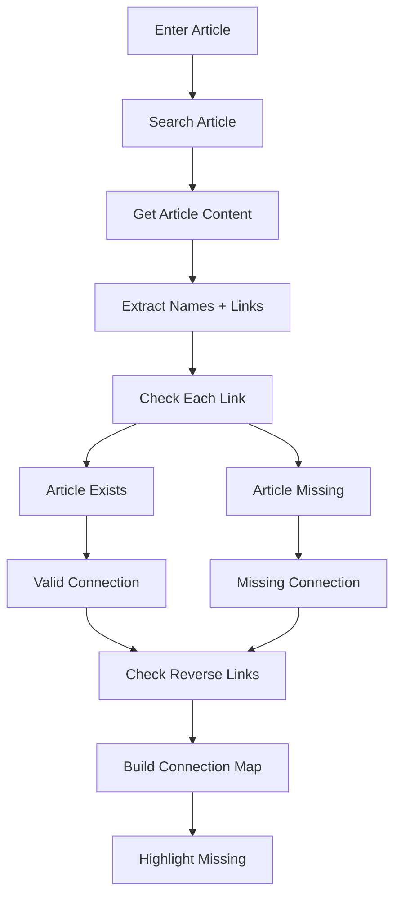
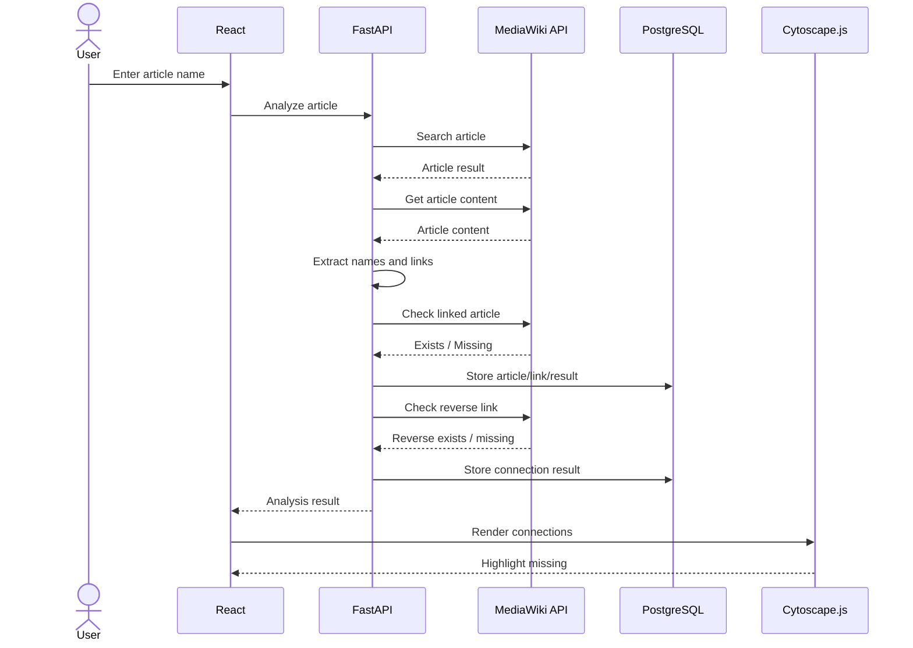
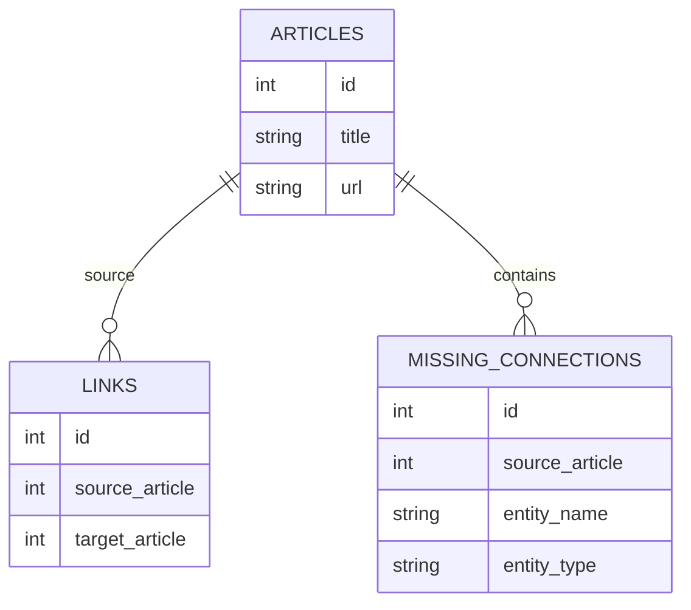

# Find the Missing Connections — Architecture

**File:** `ARCHITECTURE.md`
**Version:** 1.1
**Status:** Draft
**Owner:** `[Project Owner / Technical Lead Name]`
**Review Cycle:** Every major release and every major architectural change
**Last Updated:** Day 8 (section 11 filled in; section 12 closed out)

---

# 1. Overview / Context

**Find the Missing Connections** is a web application that analyzes an article, extracts people, places, and links, checks whether referenced entities have their own articles, detects missing connections and one-way links, and visualizes the resulting connections.

The system uses **React**, **Python/FastAPI**, **Wikipedia/MediaWiki API**, **PostgreSQL**, and **Cytoscape.js** as the core technology stack.

---

# 2. Goals & Constraints

## 2.1 Goals

The architecture must support:

1. Article input/search.
2. Article retrieval.
3. Name and place extraction.
4. Link extraction.
5. Article-existence checking.
6. Missing-connection detection.
7. Reverse-link checking.
8. One-way connection detection.
9. Connection-map generation.
10. Missing-connection highlighting.

These are the defined core project capabilities.

## 2.2 Constraints

| Constraint            | Requirement                                  |
| --------------------- | -------------------------------------------- |
| Cost                  | Use the specified free/open technology stack |
| Article source        | Wikipedia / MediaWiki API                    |
| Frontend              | React                                        |
| Backend               | Python + FastAPI                             |
| Database              | PostgreSQL                                   |
| Graph                 | Cytoscape.js                                 |
| Article retrieval     | API-based                                    |
| Wikipedia scraping    | Not permitted                                |
| Full Wikipedia mirror | Out of scope                                 |
| AI/RAG                | Out of scope for core architecture           |
| Microservices         | Out of scope                                 |
| Kubernetes            | Out of scope                                 |
| Paid vector database  | Out of scope                                 |

The source explicitly says to use MediaWiki API rather than scraping Wikipedia HTML.

---

# 3. Architecture Style

## Decision

**Layered monolith / modular web application**

The initial system will use:

```text
React Frontend
      │
      │ HTTP/REST
      ▼
FastAPI Backend
      │
      ├──────────────► MediaWiki API
      │
      ├──────────────► Analysis Logic
      │
      └──────────────► PostgreSQL
                           │
                           ▼
                    Stored Connections
```

## Why

The project has one core workflow and does not require independently deployed services.

The source explicitly says not to initially build:

* Microservices
* Kubernetes
* Full Wikipedia mirror
* Multi-agent AI
* Paid vector database
* GPU server

Therefore a modular monolith keeps the architecture aligned with the defined project scope.

---

# 4. High-Level Architecture Diagram


```mermaid
flowchart TD

    U[User]

    FE[React Frontend]

    API[FastAPI Backend]

    SEARCH[Article Search]
    ARTICLE[Article Retrieval]
    EXTRACT[Name / Place / Link Extraction]
    EXIST[Article Existence Check]
    REVERSE[Reverse Link Check]
    MAP[Connection Map Data]

    MW[Wikipedia / MediaWiki API]

    DB[(PostgreSQL)]

    GRAPH[Cytoscape.js]

    U --> FE
    FE --> API

    API --> SEARCH
    SEARCH --> MW

    API --> ARTICLE
    ARTICLE --> MW

    ARTICLE --> EXTRACT
    EXTRACT --> EXIST

    EXIST --> MW
    EXIST --> DB

    EXIST --> REVERSE
    REVERSE --> MW
    REVERSE --> DB

    DB --> MAP
    MAP --> GRAPH
    GRAPH --> FE
```

## Primary Request Flow


```mermaid
flowchart TD

    A[Enter Article]
    B[Search Article]
    C[Get Article Content]
    D[Extract Names + Links]
    E[Check Each Link]

    F[Article Exists]
    G[Article Missing]

    H[Valid Connection]
    I[Missing Connection]

    J[Check Reverse Links]
    K[Build Connection Map]
    L[Highlight Missing]

    A --> B
    B --> C
    C --> D
    D --> E

    E --> F
    E --> G

    F --> H
    G --> I

    H --> J
    I --> J

    J --> K
    K --> L
```

This follows the defined project system flow.

---

# 5. Components

Each component has one primary responsibility.

| Component            | Responsibility                                       | Owner                      |
| -------------------- | ---------------------------------------------------- | -------------------------- |
| React Frontend       | Collect input and display analysis results           | `[Frontend Owner]`         |
| FastAPI API          | Expose application endpoints and coordinate workflow | `[Backend Owner]`          |
| Article Search       | Find requested article through MediaWiki API         | `[Backend Owner]`          |
| Article Retrieval    | Retrieve article content and metadata                | `[Backend Owner]`          |
| Extraction Module    | Extract names, places and links                      | `[Backend Owner]`          |
| Existence Checker    | Determine whether referenced article exists          | `[Backend Owner]`          |
| Reverse Link Checker | Determine whether B links back to A                  | `[Backend Owner]`          |
| Connection Store     | Persist articles, links and missing connections      | `[Database Owner]`         |
| Graph Adapter        | Convert stored connections into graph data           | `[Frontend/Backend Owner]` |
| Cytoscape.js Graph   | Render connection map                                | `[Frontend Owner]`         |

### Responsibility Boundary

```text
Frontend
  ↓
Presentation only

FastAPI
  ↓
Request coordination

Analysis Modules
  ↓
Connection analysis

PostgreSQL
  ↓
Persistent project data

MediaWiki API
  ↓
External article source

Cytoscape.js
  ↓
Connection visualization
```

---

# 6. Data Flow

## 6.1 Article Analysis


```mermaid
sequenceDiagram

    actor User
    participant UI as React
    participant API as FastAPI
    participant MW as MediaWiki API
    participant DB as PostgreSQL
    participant Graph as Cytoscape.js

    User->>UI: Enter article name
    UI->>API: Analyze article
    API->>MW: Search article
    MW-->>API: Article result

    API->>MW: Get article content
    MW-->>API: Article content

    API->>API: Extract names and links

    API->>MW: Check linked article
    MW-->>API: Exists / Missing

    API->>DB: Store article/link/result

    API->>MW: Check reverse link
    MW-->>API: Reverse exists / missing

    API->>DB: Store connection result

    API-->>UI: Analysis result
    UI->>Graph: Render connections
    Graph-->>UI: Highlight missing
```

## 6.2 Connection States

Every connection can result in:

```text
EXISTS
MISSING
ONE-WAY
```

The source explicitly defines these result states.

---

# 7. Tech Stack

Resolved during Development. The source did not specify versions, so they are
taken from what the code actually constrains, not invented.

| Layer          | Technology                | Version         | Why Chosen                                       |
| -------------- | ------------------------- | --------------- | ------------------------------------------------ |
| Frontend       | React                     | `^19.2`         | Defined frontend technology                      |
| Backend        | Python                    | `>=3.12`        | Defined backend language                         |
| API Framework  | FastAPI                   | `>=0.115`       | Defined backend framework                        |
| Routing        | react-router-dom          | `^7.9`          | Five screens, deep links must survive a refresh  |
| Build          | Vite                      | `^8.3`          | SPA build; `npm run build` is the release artefact |
| Lint           | oxlint                    | `^1.81`         | The only configured linter in the repository     |
| Article Source | Wikipedia / MediaWiki API | `action=query`  | Direct article/link access without HTML scraping |
| Database       | PostgreSQL                | `16-alpine`     | Defined persistent storage                       |
| Graph          | Cytoscape.js              | `^3.33`         | Defined connection-map technology                |
| Proxy          | nginx                     | `1.27-alpine`   | Serves the SPA and proxies the API on one origin |

`ARCHITECTURE.md` §11 covers how these are deployed. One consequence is recorded
in `AGENTS.md` §9 and is not obvious: **Cytoscape cannot read CSS custom
properties**, so the connection map is the one place design tokens must be
resolved to literals at runtime.

---

# 8. Data Storage

## 8.1 PostgreSQL

PostgreSQL stores only the data required for the core project.

### Articles

```text
articles
---------
id
title
url
```

### Links

```text
links
-----
id
source_article
target_article
```

### Missing Connections

```text
missing_connections
-------------------
id
source_article
entity_name
entity_type
```

These are the three storage structures explicitly defined by the source.

---

## 8.2 Storage Relationship


```mermaid
erDiagram

    ARTICLES ||--o{ LINKS : source
    ARTICLES ||--o{ MISSING_CONNECTIONS : contains

    ARTICLES {
        int id
        string title
        string url
    }

    LINKS {
        int id
        int source_article
        int target_article
    }

    MISSING_CONNECTIONS {
        int id
        int source_article
        string entity_name
        string entity_type
    }
```

## 8.3 Caching

The source specifies response caching as a performance strategy:

```text
User Request
     ↓
Cache
     ↓
Exists?
 ┌───┴───┐
YES     NO
 ↓       ↓
Return  MediaWiki API
         ↓
       Store
         ↓
       Return
```

### Cache Strategy

* Cache article/API responses where appropriate.
* Reuse cached data instead of repeatedly requesting the external API.
* Cache duration: **TBD during implementation**.
* Cache storage technology: **TBD** because the source does not prescribe one.

---

# 9. Integrations

## 9.1 Wikipedia / MediaWiki API

**Purpose:** Retrieve article data, links, and page-existence information.

**Protocol:** HTTP API

**Owner:** `[Backend Owner]`

### Flow

```text
FastAPI
   │
   ▼
MediaWiki API
   │
   ├── Article
   ├── Links
   └── Page existence
```

The architecture intentionally uses the MediaWiki API instead of scraping Wikipedia HTML.

### Timeout

`TBD`

The source requires API timeout handling but does not provide a numeric timeout value.

### Retry Policy

`TBD`

The source does not define a numeric retry count or backoff strategy.

### Failure Behaviour

If the external API cannot provide required article data:

```text
Request
   ↓
MediaWiki API
   ↓
Failure
   ↓
Backend returns controlled error
   ↓
Frontend displays failure state
```

---

# 10. Cross-Cutting Concerns

## 10.1 Authentication

Authentication is **not part of the defined core workflow**.

If authentication becomes a required project requirement, this architecture must be updated before implementation.

## 10.2 Input Validation

The backend must validate article input before processing it.

The source explicitly identifies input validation as a security requirement.

## 10.3 Logging

Application errors and important processing failures should be logged.

**Logging technology:** TBD.

## 10.4 Monitoring

Production monitoring is required for the deployed system.

**Monitoring platform:** TBD.

## 10.5 Error Handling

Errors must be handled at the API boundary instead of exposing raw internal exceptions to the frontend.

Primary failure categories:

* Invalid article input
* Article not found
* MediaWiki API failure
* Database failure
* Graph-data generation failure

## 10.6 Secrets

External API configuration and database credentials must not be hard-coded into source code.

Secrets must be provided through environment configuration.

---

# 11. Deployment / Infrastructure

Decided during Phase 6 and recorded in `deploy/`. This section replaces the
placeholder that stood here until then.

## 11.1 Target

**One host, three containers, Docker Compose.** Kubernetes, microservices and
managed CI/CD platforms are out of scope (§2.2), and the system has a single
workflow with no independently-scaled component, so a compose stack is the whole
deployment. Nothing needs to be more complicated than this to be correct.

| Container | Image | Role | Published |
| --------- | ----- | ---- | --------- |
| `web` | `frontend/Dockerfile` | nginx; serves the built SPA, reverse-proxies `/api` | host port 80 (staging: 8080) |
| `api` | `backend/Dockerfile` | FastAPI under uvicorn | nothing; `expose` only |
| `db` | `postgres:16-alpine` | analysis cache | nothing; `expose` only |

Neither application port is published in production. Only nginx is.

## 11.2 Why one origin

The SPA calls a **relative** `/api` (`frontend/src/api/client.js:3`). In a
deployment nginx terminates the browser connection and forwards `/api` to the
backend, so no request is cross-origin and the backend's CORS middleware is never
on the request path. CORS exists for the dev server, where Vite runs on :5173 and
the backend on :8000.

`proxy_pass` is written without a trailing path. A trailing slash would strip the
`/api` prefix and every route would 404.

## 11.3 Image builds

Both are multi-stage and neither contains a development dependency or a Node
runtime. The backend copies `app/` and `requirements.txt` only — **no `.env` and
no `tests/`** — so no credential can end up in a layer. It runs as a non-root
user and declares a `HEALTHCHECK` against `/api/health`; compose gates the
frontend on that healthcheck, so a browser never reaches a container that cannot
serve.

The frontend is built with `npm ci` against the committed lockfile, so the image
is reproducible. `VITE_API_BASE_URL` is deliberately **not** set at build time,
which is what keeps the relative `/api` working in every environment.

nginx is configured from `frontend/nginx.conf.template`, installed as an official
nginx *template*, so `${API_UPSTREAM}` is expanded from the environment at
start-up. One built image serves staging and production.

## 11.4 Configuration and secrets

`Settings` reads the process environment. There is no configuration file inside
any image; every value is supplied by the orchestrator. `deploy/.env` is ignored
by the repository `.gitignore`, and `deploy/.env.production.example` documents
every credential a host must supply.

The production compose file uses `${VAR:?message}` for the password and user
agent, so compose **refuses to start** rather than falling back to a default.

## 11.5 Database

PostgreSQL remains a **cache**, not a source of truth (§8.3). The API creates
its tables on start-up via `create_all()`; `database/init.sql` is the authority
for anything `create_all()` cannot express, namely the partial index
`ix_article_links_missing`, and it is applied by hand on a first deployment.

`init.sql` is idempotent and contains no `DROP`, so re-applying it is safe and an
older API image works against a newer schema. That is the property that makes
rollback free — see `docs/ROLLBACK.md` §1.

## 11.6 Health, logs, monitoring

- Liveness: `GET /api/health` returns `status`, `version` and
  `database_enabled`. It is the backend `HEALTHCHECK` target and the smoke test's
  first check.
- Logs: the app configures stdlib `logging` to stdout at `INFO`
  (`app/main.py:19-23`). Docker's json-file driver captures it. **No log
  aggregation platform is configured** — see §12.
- Monitoring: none. §10.4 required it and it is still outstanding; there is no
  metrics exporter, no uptime check, and no alerting. The smoke test is the only
  automated health signal, and it runs when someone runs it.

## 11.7 Continuous integration

`.github/workflows/ci.yml` runs on every push and pull request: `pytest` on
Python 3.12, `oxlint`, `vite build`, both container images built and **booted**,
a request against the running stack, and a check that the table set in
`app/models.py` matches `database/init.sql`.

Building the images is not the point; booting them is. A Dockerfile that builds
but cannot start is the failure mode a build-only gate cannot see.

There is **no image registry** and no CD pipeline. Images are built on the host
they deploy from, which means a host rebuild loses every older tag and with it
the rollback target. This is the main open item in §12.

## 11.8 Component Substitution Fallbacks

Added in `442500c`. This is **not** deployment rollback — that is
`docs/ROLLBACK.md` §4, and it is about restoring a previous build. This section
answers a different question: if a technology choice itself turns out not to
support the core workflow, what replaces it?

1. **Graph Visualization (Cytoscape.js):** If Cytoscape.js proves unsuitable for
   the connection map, fall back to **D3.js** or a static HTML list visualization
   until a suitable library is identified.
2. **Database (PostgreSQL):** The database is only used for best-effort caching
   and recent analyses. If the PostgreSQL dependency becomes a blocker, fall back
   to an in-memory cache (or SQLite) and disable persistence to keep the core API
   functional. This is already the supported behaviour: an empty `DATABASE_URL`
   boots the app with `database_enabled: false`.
3. **API Framework (FastAPI):** If FastAPI presents insurmountable issues, the
   backend logic is decoupled enough (`routers → services → client`) to revert to
   a standard Flask or standard-library WSGI application.
4. **Article Source (MediaWiki API):** We rely exclusively on the MediaWiki API.
   If a specific endpoint (page existence, links) fails to meet needs, revert to
   alternative endpoints within the MediaWiki API suite (Action API vs REST API)
   rather than scraping HTML, which remains out of scope (§2.2).

---

# 12. Open Questions

* Cache technology and TTL. **Resolved:** PostgreSQL, already in the stack, used as
  a write-through cache. No TTL is implemented, so the cache never expires; it is
  invalidated by re-analysis.
* External API timeout value. **Resolved:** 20s, `http_timeout_seconds`
  (`config.py:27`), with two attempts and a 1s gap in `mediawiki.py`.
* External API retry count and backoff strategy. **Resolved:** two attempts, fixed
  1s sleep. No exponential backoff, which is a possible improvement rather than a
  gap.
* Logging platform. **Open.** Logs go to stdout and Docker captures them. No
  aggregation or retention.
* Monitoring platform. **Open.** Nothing is configured; see §11.6.
* Deployment target and hosting model. **Resolved:** single-host Docker Compose,
  §11.1.
* Image registry and rollback durability. **Open, and the main release risk.**
  Images are built on the deploying host, so a rebuild destroys the rollback
  target. Needs a registry before a production release is worth calling
  reversible.
