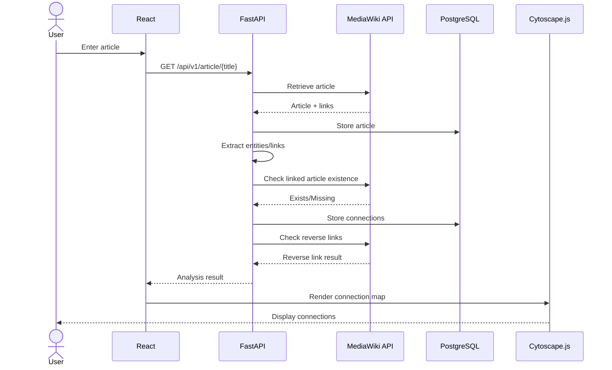

# Technical Requirements Document (TRD)

## Project: Find the Missing Connections

**TRD Version:** 1.0
**Date:** 26 September 2026
**Status:** Draft
**Author:** TBD
**PRD:** Find the Missing Connections — PRD v1.0
**Implementation Status:** Not Started
**Approval:** Pending Tech Lead + QA + DevOps

---

# 1. Context / Problem

## 1.1 Technical Context

The system receives an article from Wikipedia/MediaWiki and analyzes its relationships.

The technical problem is to:

1. Retrieve an article.
2. Extract names and links.
3. Determine whether referenced people/places/articles have corresponding articles.
4. Identify missing connections.
5. Check reverse links between articles.
6. Build a connection map.
7. Highlight missing connections.

The source explicitly defines this core implementation.

## 1.2 PRD Reference

This TRD implements the requirements defined in:

> **PRD — Find the Missing Connections, Version 1.0**

The PRD defines the product behavior; this TRD defines the technical implementation.

## 1.3 Technical Problem

The application must obtain article/link information through the MediaWiki API instead of scraping Wikipedia HTML.

The source explicitly recommends:

```text
Application
    ↓
MediaWiki API
    ↓
Article
    ↓
Links
    ↓
Page existence
```

and explicitly rejects direct HTML scraping as the core approach.

---

# 2. Scope

## 2.1 In Scope

| ID     | Priority | Requirement                                                                |
| ------ | -------- | -------------------------------------------------------------------------- |
| TRD-01 | P0       | System shall provide article search/input.                                 |
| TRD-02 | P0       | System shall retrieve article information through Wikipedia/MediaWiki API. |
| TRD-03 | P0       | System shall extract people from the article.                              |
| TRD-04 | P0       | System shall extract places from the article.                              |
| TRD-05 | P0       | System shall extract article links.                                        |
| TRD-06 | P0       | System shall check article existence for extracted connections.            |
| TRD-07 | P0       | System shall identify missing connections.                                 |
| TRD-08 | P0       | System shall check reverse article links.                                  |
| TRD-09 | P0       | System shall identify one-way connections.                                 |
| TRD-10 | P0       | System shall store required article/link/missing-connection data.          |
| TRD-11 | P0       | System shall generate a connection map.                                    |
| TRD-12 | P0       | System shall visually highlight missing connections.                       |

These requirements correspond to the defined core implementation.

---

## 2.2 Out of Scope

| ID     | Priority | Excluded                       |
| ------ | -------- | ------------------------------ |
| TRD-13 | P0       | RAG                            |
| TRD-14 | P0       | Semantic Search                |
| TRD-15 | P0       | AI Research Assistant          |
| TRD-16 | P0       | Article Recommendation Engine  |
| TRD-17 | P0       | Topic Classification           |
| TRD-18 | P0       | Educational Learning Assistant |
| TRD-19 | P0       | Full Wikipedia mirror          |
| TRD-20 | P0       | Millions of embeddings         |
| TRD-21 | P0       | Multi-agent AI                 |
| TRD-22 | P0       | Fine-tuned LLM                 |
| TRD-23 | P0       | Kubernetes                     |
| TRD-24 | P0       | Microservices                  |
| TRD-25 | P0       | Paid vector database           |
| TRD-26 | P0       | Paid AI API                    |
| TRD-27 | P0       | GPU server                     |

The source explicitly identifies these as unnecessary for the initial implementation.

---

# 3. Architecture Overview

## 3.1 Architecture

The source specifies React for frontend, FastAPI for backend, Wikipedia/MediaWiki API as the article source, PostgreSQL as database, and Cytoscape.js for the connection map.

```text
                         ┌─────────────────┐
                         │      USER       │
                         └────────┬────────┘
                                  │
                                  ▼
                         ┌─────────────────┐
                         │  React Frontend │
                         └────────┬────────┘
                                  │
                              REST API
                                  │
                                  ▼
                         ┌─────────────────┐
                         │ FastAPI Backend │
                         └───────┬─────────┘
                                 │
                ┌────────────────┼────────────────┐
                │                │                │
                ▼                ▼                ▼
       ┌────────────────┐ ┌─────────────┐ ┌──────────────┐
       │ MediaWiki API  │ │  Analysis   │ │ PostgreSQL   │
       │                │ │   Logic     │ │              │
       └────────────────┘ └──────┬──────┘ └──────────────┘
                                 │
                                 ▼
                        ┌──────────────────┐
                        │ Connection Data  │
                        └────────┬─────────┘
                                 │
                                 ▼
                        ┌──────────────────┐
                        │  Cytoscape.js    │
                        │ Connection Map   │
                        └──────────────────┘
```

---

## 3.2 End-to-End Flow

```text
User
  │
  ▼
Enter Article
  │
  ▼
Search Article
  │
  ▼
Get Article Content
  │
  ▼
Extract Names + Links
  │
  ▼
Check Each Link
  │
  ├───────────────┐
  ▼               ▼
EXISTS          MISSING
  │               │
  └───────┬───────┘
          ▼
   Check Reverse Links
          │
          ▼
   Build Connection Map
          │
          ▼
   Highlight Missing
```

This matches the source-defined basic system flow.

---

# 4. Tech Stack

## 4.1 Technology Requirements

| ID     | Priority | Layer          | Technology                |
| ------ | -------- | -------------- | ------------------------- |
| TRD-28 | P0       | Frontend       | React                     |
| TRD-29 | P0       | Backend        | Python + FastAPI          |
| TRD-30 | P0       | Article Source | Wikipedia / MediaWiki API |
| TRD-31 | P0       | Database       | PostgreSQL                |
| TRD-32 | P0       | Graph          | Cytoscape.js              |

The source defines this as the free implementation stack.

## 4.2 Versions

The source does not specify exact software versions.

Therefore:

| Component    | Required Version          |
| ------------ | ------------------------- |
| React        | TBD before implementation |
| Python       | TBD before implementation |
| FastAPI      | TBD before implementation |
| PostgreSQL   | TBD before implementation |
| Cytoscape.js | TBD before implementation |

No unsupported version number will be invented in this TRD.

---

# 5. Data Model

The core system stores only the data required for the project.

The source defines three required data groups: Articles, Links, and Missing Connections.

## 5.1 Articles

```text
articles
---------
id
title
url
```

### Requirements

**TRD-33 — P0**

The `articles` entity shall contain a unique article identifier.

**TRD-34 — P0**

The `articles` entity shall contain the article title.

**TRD-35 — P0**

The `articles` entity shall contain the article URL.

---

## 5.2 Links

```text
links
-----
id
source_article
target_article
```

### Requirements

**TRD-36 — P0**

The `links` entity shall identify the source article.

**TRD-37 — P0**

The `links` entity shall identify the target article.

**TRD-38 — P0**

A stored link shall represent a directed relationship from source article to target article.

---

## 5.3 Missing Connections

```text
missing_connections
-------------------
id
source_article
entity_name
entity_type
```

### Requirements

**TRD-39 — P0**

The missing connection shall reference its source article.

**TRD-40 — P0**

The missing connection shall contain the entity name.

**TRD-41 — P0**

The missing connection shall contain the entity type.

Supported types defined by the source:

```text
Person
Place
```

---

## 5.4 Database Indexing

The source does not specify an indexing strategy.

Required indexing decisions are therefore:

**TRD-42 — P1**

Database indexing strategy shall be finalized before production deployment.

**Status:** TBD.

**TRD-43 — P1**

The final indexing strategy shall be documented as an ADR before approval.

---

# 6. API Contract

The backend shall expose REST endpoints required by the core application.

The source identifies the following API structure as the intended backend design.

## 6.1 API Version

**TRD-44 — P0**

The API shall expose version `v1`.

Base path:

```text
/api/v1
```

---

# 6.2 Search Article

### Endpoint

```http
GET /api/v1/search?q=Albert%20Einstein
```

### Request

```http
GET /api/v1/search?q=Albert%20Einstein
Accept: application/json
```

### Response — 200

```json
{
  "results": [
    {
      "title": "Albert Einstein",
      "url": "https://en.wikipedia.org/wiki/Albert_Einstein"
    }
  ]
}
```

### Status Codes

```text
200 OK
400 Bad Request
404 Not Found
502 Bad Gateway
```

---

# 6.3 Get Article

### Endpoint

```http
GET /api/v1/article/{title}
```

### Example

```http
GET /api/v1/article/Albert%20Einstein
```

### Response — 200

```json
{
  "id": "article-001",
  "title": "Albert Einstein",
  "url": "https://en.wikipedia.org/wiki/Albert_Einstein"
}
```

---

# 6.4 Get Article Links

### Endpoint

```http
GET /api/v1/article/{title}/links
```

### Response — 200

```json
{
  "source_article": "Albert Einstein",
  "links": [
    {
      "title": "Max Planck",
      "exists": true
    },
    {
      "title": "Example Missing Person",
      "exists": false
    }
  ]
}
```

---

# 6.5 Get Missing Connections

### Endpoint

```http
GET /api/v1/article/{title}/missing
```

### Response — 200

```json
{
  "source_article": "Example Article",
  "missing_connections": [
    {
      "entity_name": "Person X",
      "entity_type": "Person"
    },
    {
      "entity_name": "Place Y",
      "entity_type": "Place"
    }
  ]
}
```

---

# 6.6 Get Connections

### Endpoint

```http
GET /api/v1/article/{title}/connections
```

### Response — 200

```json
{
  "source_article": "Example Article",
  "connections": [
    {
      "target": "Person A",
      "status": "EXISTS"
    },
    {
      "target": "Person X",
      "status": "MISSING"
    }
  ]
}
```

---

# 6.7 Get Graph

### Endpoint

```http
GET /api/v1/graph/{title}
```

### Response — 200

```json
{
  "nodes": [
    {
      "id": "article-001",
      "label": "Example Article",
      "type": "article",
      "status": "EXISTS"
    },
    {
      "id": "person-001",
      "label": "Person X",
      "type": "person",
      "status": "MISSING"
    }
  ],
  "edges": [
    {
      "source": "article-001",
      "target": "person-001",
      "type": "connection"
    }
  ]
}
```

---

# 6.8 API Error Format

All API errors shall use a consistent structure:

```json
{
  "error": {
    "code": "ARTICLE_NOT_FOUND",
    "message": "The requested article was not found."
  }
}
```

---

# 7. Business Logic / Algorithms

## 7.1 Article Analysis Algorithm

**TRD-45 — P0**

The system shall execute article analysis in the following order:

```text
1. Receive article title
2. Search article
3. Retrieve article
4. Extract names
5. Extract links
6. Check article existence
7. Store connection result
8. Check reverse links
9. Build connection map
10. Highlight missing connections
```

This sequence is defined by the source workflow.

---

## 7.2 Connection Status

Every analyzed connection shall have one logical result:

```text
EXISTS
MISSING
ONE-WAY
```

The source explicitly defines these result states.

---

## 7.3 Existing Connection

**TRD-46 — P0**

If the target article exists, the connection shall be classified as `EXISTS`.

```text
Entity
  ↓
Article exists
  ↓
EXISTS
```

---

## 7.4 Missing Connection

**TRD-47 — P0**

If the target article does not exist, the connection shall be classified as `MISSING`.

```text
Entity
  ↓
No article
  ↓
MISSING
```

This behavior is explicitly defined in the source.

---

## 7.5 One-Way Connection

**TRD-48 — P0**

For an existing relationship:

```text
A → B
```

the system shall check whether:

```text
B → A
```

exists.

If the reverse relationship does not exist:

```text
A → B
B → A ❌
```

the relationship shall be classified as `ONE-WAY`.

---

# 8. Integration Points

## 8.1 MediaWiki API

**TRD-49 — P0**

The backend shall use the Wikipedia/MediaWiki API as the article data source.

**TRD-50 — P0**

The backend shall obtain article links through the API rather than scraping Wikipedia HTML.

**TRD-51 — P0**

The backend shall use the API's article/page existence information to determine whether a connection exists.

The source explicitly identifies MediaWiki API support for links and missing pages.

---

## 8.2 External API Dependency

```text
FastAPI
   │
   ▼
MediaWiki API
   │
   ├── Article
   ├── Links
   └── Page existence
```

No additional external API is required by the core project.

---

# 9. Data Consistency & Transactions

## 9.1 Article Storage

**TRD-52 — P0**

Article creation/update and its associated connection records shall maintain referential integrity.

## 9.2 Link Storage

**TRD-53 — P0**

A link shall not be stored without a valid source article.

## 9.3 Missing Connection Storage

**TRD-54 — P0**

A missing connection shall not be stored without a source article.

## 9.4 Idempotency

**TRD-55 — P1**

Repeating analysis of the same article shall not intentionally create duplicate logical article records.

## 9.5 Transaction Boundary

The exact transaction boundary is not specified by the source.

**TRD-56 — P1**

The database transaction strategy shall be finalized before production deployment.

**Status:** TBD.

---

# 10. Error Handling & Failure Modes

## 10.1 Empty Article Input

**TRD-57 — P0**

An empty article input shall return HTTP `400`.

```json
{
  "error": {
    "code": "INVALID_ARTICLE",
    "message": "Article name is required."
  }
}
```

---

## 10.2 Article Not Found

**TRD-58 — P0**

If the requested article cannot be found, the backend shall return HTTP `404`.

```json
{
  "error": {
    "code": "ARTICLE_NOT_FOUND",
    "message": "The requested article was not found."
  }
}
```

---

## 10.3 External API Failure

**TRD-59 — P0**

If the MediaWiki API fails, the backend shall return an external-service error rather than treating the article as missing.

Suggested response:

```http
502 Bad Gateway
```

---

## 10.4 API Timeout

**TRD-60 — P0**

The backend shall use an explicit timeout for external MediaWiki API requests.

**Timeout value:** TBD before implementation.

The source requires API timeout handling but does not define the numeric timeout value.

---

## 10.5 Caching Failure

**TRD-61 — P1**

If cached article data is unavailable, the system shall attempt to retrieve the article from the MediaWiki API.

The source recommends caching to avoid repeated Wikipedia calls.

---

# 11. Security & Permissions

## 11.1 Input Validation

**TRD-62 — P0**

The backend shall validate article input before processing it.

## 11.2 Rate Limiting

**TRD-63 — P0**

The backend shall implement rate limiting.

**Limit:** TBD before production deployment.

## 11.3 Arbitrary URL Protection

**TRD-64 — P0**

The backend shall not accept arbitrary user-provided URLs for server-side fetching.

This prevents the SSRF risk identified in the source.

## 11.4 Authentication

The source lists authentication as part of the broader technology discussion, but the core project requirements do not define an authentication workflow.

**TRD-65 — P1**

Authentication requirement shall be decided before production deployment.

**Status:** TBD.

## 11.5 PII

The source does not define collection or storage of user PII.

**TRD-66 — P0**

The core application shall not introduce user PII storage beyond what is required for the defined functionality.

---

# 12. Performance & Scalability

The source explicitly recommends avoiding repeated Wikipedia requests and starting with a manageable article set rather than downloading all of Wikipedia.

## 12.1 Caching

**TRD-67 — P0**

The application shall cache retrieved article data to reduce repeated external API requests.

```text
User Request
     ↓
Cache
     ↓
Exists?
 ┌───┴───┐
Yes      No
 │        │
 ▼        ▼
Return   MediaWiki API
          │
          ▼
        Store
          │
          ▼
        Return
```

---

## 12.2 Dataset Scope

**TRD-68 — P0**

The initial implementation shall analyze articles on demand rather than downloading the entire Wikipedia dataset.

The source recommends beginning with approximately `10–100` articles and scaling only as required.

---

## 12.3 Performance Targets

The source does not define:

* QPS
* p50 latency
* p95 latency
* p99 latency
* maximum concurrent users
* load-test throughput

Therefore these values are **TBD before production approval**.

| Metric             | Target |
| ------------------ | -----: |
| QPS                |    TBD |
| p50                |    TBD |
| p95                |    TBD |
| p99                |    TBD |
| Concurrent users   |    TBD |
| Load-test duration |    TBD |

No unsupported performance number is being invented.

---

# 13. Observability

The source does not define a logging/metrics/tracing platform.

The following technical requirements are therefore defined as implementation decisions pending final platform selection.

## 13.1 Logging

**TRD-69 — P1**

Backend shall log:

* Request endpoint
* Request status
* Article identifier/title
* External API success/failure
* Analysis status
* Database errors

## 13.2 Metrics

**TRD-70 — P1**

The system shall expose metrics for:

* Article searches
* Article retrieval failures
* Missing connections detected
* One-way connections detected
* API failures
* API timeouts

Metric thresholds are **TBD**.

## 13.3 Tracing

**TRD-71 — P2**

Distributed tracing is not required for the initial core implementation.

---

# 14. Feature Flags / Rollout

The source does not define a feature-flag platform.

## Required Rollout

**TRD-72 — P0**

The first release shall expose only the core functionality defined in this TRD.

```text
Article Search
      ↓
Article Analysis
      ↓
Missing Connections
      ↓
One-Way Connections
      ↓
Connection Map
```

## Kill Switch

**TRD-73 — P1**

A production kill-switch mechanism shall be defined before production deployment if the deployment environment requires one.

**Implementation:** TBD.

---

# 15. Testing Strategy

## 15.1 Unit Testing

**TRD-74 — P0**

Unit tests shall cover:

* Article input validation
* Entity extraction
* Link extraction
* Article existence classification
* Missing connection classification
* Reverse-link detection
* Connection status generation

---

## 15.2 Integration Testing

**TRD-75 — P0**

Integration tests shall verify:

```text
FastAPI
   ↓
MediaWiki API
   ↓
Analysis
   ↓
PostgreSQL
```

---

## 15.3 API Testing

**TRD-76 — P0**

Each API endpoint defined in Section 6 shall have tests for:

* Successful request
* Invalid input
* Article not found
* External API failure
* Empty result

---

## 15.4 End-to-End Testing

**TRD-77 — P0**

The complete flow shall be tested:

```text
Enter Article
    ↓
Search
    ↓
Retrieve Article
    ↓
Extract Links
    ↓
Check Existence
    ↓
Detect Missing
    ↓
Check Reverse Links
    ↓
Build Map
    ↓
Highlight Missing
```

---

## 15.5 Acceptance Criteria Mapping

| Requirement | Test                               |
| ----------- | ---------------------------------- |
| TRD-01      | User can submit article name       |
| TRD-02      | Article retrieval integration test |
| TRD-03      | Person extraction unit test        |
| TRD-04      | Place extraction unit test         |
| TRD-05      | Link extraction unit test          |
| TRD-06      | Article existence integration test |
| TRD-07      | Missing connection test            |
| TRD-08      | Reverse-link test                  |
| TRD-09      | One-way connection test            |
| TRD-10      | Database persistence test          |
| TRD-11      | Graph generation test              |
| TRD-12      | Missing-node visual/E2E test       |

---

# 16. Migration & Backfill Plan

## 16.1 Initial Database

The application starts with the required core tables:

```text
articles
links
missing_connections
```

No large Wikipedia backfill is required.

---

## 16.2 On-Demand Population

The source recommends:

```text
User searches article
       ↓
Fetch article
       ↓
Analyze article
       ↓
Cache/store
       ↓
Build graph
```

rather than downloading all of Wikipedia.

**TRD-78 — P0**

Article data shall be populated on demand.

---

## 16.3 Migration

**TRD-79 — P1**

All schema changes shall be implemented through versioned database migrations.

## 16.4 Rollback

**TRD-80 — P0**

Every production database migration shall have a documented rollback strategy before execution.

Migration rollback details are **TBD** because no production migration system is specified in the source.

---

# 17. Dependencies & Risks

## 17.1 External API Dependency

**TRD-81 — P0**

The application depends on Wikipedia/MediaWiki API availability.

**Risk:** External API unavailable.

**Mitigation:** Error handling + caching.

---

## 17.2 API Rate/Request Limits

**TRD-82 — P1**

The system shall avoid unnecessary repeated external requests.

**Mitigation:** Cache article data.

---

## 17.3 Entity Extraction Accuracy

**TRD-83 — P1**

Incorrect identification of people or places may produce incorrect missing connections.

**Mitigation:** Extraction logic shall be independently tested.

---

## 17.4 SSRF

**TRD-84 — P0**

The backend shall not fetch arbitrary URLs submitted by users.

**Mitigation:** Use the defined MediaWiki integration.

---

## 17.5 Large Dataset Risk

**TRD-85 — P0**

The system shall not initially attempt to store the entire Wikipedia dataset.

The source explicitly warns against downloading millions of articles and embeddings for the free implementation.

---

# 18. Decision Records / ADRs

Every non-trivial technical decision shall be recorded.

## ADR-001 — MediaWiki API Instead of HTML Scraping

**Decision:** Use MediaWiki API.

**Why:** The source states that the API directly supports retrieving links and identifying missing pages.

**Alternative considered:** Wikipedia HTML + BeautifulSoup.

**Rejected because:** The defined project specifically recommends API-based retrieval instead of scraping.

---

## ADR-002 — React Frontend

**Decision:** Use React.

**Why:** React is the frontend technology defined by the project.

**Alternative:** Not specified by source.

---

## ADR-003 — FastAPI Backend

**Decision:** Use Python + FastAPI.

**Why:** FastAPI is the defined backend technology.

**Alternative:** Not specified by source.

---

## ADR-004 — PostgreSQL

**Decision:** Use PostgreSQL.

**Why:** The core project requires persistent article, link, and missing-connection data.

**Alternative:** Not specified by source.

---

## ADR-005 — Cytoscape.js

**Decision:** Use Cytoscape.js for the connection map.

**Why:** Cytoscape.js is the specified connection-map technology.

**Alternative:** React Flow appears in the broader source as another graph option, but the core project specifically defines Cytoscape.js.

---

## ADR-006 — On-Demand Article Retrieval

**Decision:** Retrieve and analyze articles on demand.

**Why:** The source explicitly recommends avoiding a full Wikipedia download and starting with a small/manageable dataset.

**Alternative:** Download entire Wikipedia.

**Rejected because:** It is unnecessary for the core project and would create excessive storage/processing requirements.

---

# 19. Appendix A — Sequence Diagram



---

# 20. Appendix B — Connection State Diagram

```text
                 ┌─────────────┐
                 │   LINK      │
                 │ DISCOVERED  │
                 └──────┬──────┘
                        │
                        ▼
               ┌─────────────────┐
               │ Check existence  │
               └────────┬────────┘
                        │
              ┌─────────┴─────────┐
              │                   │
              ▼                   ▼
        ┌──────────┐        ┌──────────┐
        │ EXISTS   │        │ MISSING  │
        └────┬─────┘        └──────────┘
             │
             ▼
       Check reverse
             │
       ┌─────┴─────┐
       │           │
       ▼           ▼
    Reverse      Reverse
    EXISTS       MISSING
       │           │
       ▼           ▼
   BIDIRECTIONAL  ONE-WAY
```

---

# 21. Appendix C — Core Project Structure

```text
find-missing-connections/
│
├── frontend/
│   ├── components/
│   ├── pages/
│   └── graph/
│
├── backend/
│   ├── api/
│   ├── services/
│   ├── database/
│   ├── wikipedia/
│   └── main.py
│
├── tests/
│   ├── unit/
│   ├── integration/
│   └── e2e/
│
└── README.md
```

The source defines the frontend/backend separation and corresponding project organization.

---

# 22. Appendix D — Final Technical Flow

```text
                    FIND THE MISSING CONNECTIONS
                              │
                              ▼
                       React Frontend
                              │
                              ▼
                        FastAPI Backend
                              │
                    ┌─────────┴─────────┐
                    ▼                   ▼
             MediaWiki API          PostgreSQL
                    │                   │
                    ▼                   ▼
              Article + Links      Stored Results
                    │
                    ▼
             Entity/Link Analysis
                    │
          ┌─────────┴──────────┐
          ▼                    ▼
       EXISTS                MISSING
          │                    │
          ▼                    ▼
   Reverse Link Check    Missing Connection
          │
     ┌────┴────┐
     ▼         ▼
   EXISTS    MISSING
     │         │
     ▼         ▼
   Valid     ONE-WAY
     │         │
     └────┬────┘
          ▼
   Connection Map
          │
          ▼
   Highlight Missing
```

---

# 23. Release Acceptance

The release shall not be marked technically complete until:

* [ ] TRD-01 through TRD-12 are implemented.
* [ ] P0 requirements pass their linked tests.
* [ ] API contracts are tested.
* [ ] Database constraints are tested.
* [ ] MediaWiki failure scenarios are tested.
* [ ] Missing connections are correctly identified.
* [ ] One-way connections are correctly identified.
* [ ] Connection map is rendered.
* [ ] Missing connections are visually highlighted.
* [ ] Rollback procedure is documented.
* [ ] Security requirements are tested.
* [ ] QA approval is received.
* [ ] DevOps approval is received.
* [ ] Tech Lead approval is received.

---

# 24. Sign-Off

| Role      | Name | Status  | Date |
| --------- | ---- | ------- | ---- |
| Tech Lead | TBD  | Pending | TBD  |
| QA        | TBD  | Pending | TBD  |
| DevOps    | TBD  | Pending | TBD  |

## Approval Rule

The TRD status shall remain **Draft/In Review** until:

1. Technical review is completed.
2. Review comments are resolved.
3. Required PRD requirements are traceable.
4. P0 acceptance tests are defined.
5. Tech Lead signs off.
6. QA signs off.
7. DevOps signs off.

Only then may the document become:

> **Approved — Version 1.0**

---

# 25. Revision History

| Version | Date        | Author | Status | Change      |
| ------- | ----------- | ------ | ------ | ----------- |
| 1.0     | 26 Sep 2026 | TBD    | Draft  | Initial TRD |
